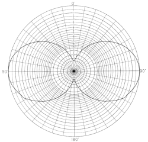
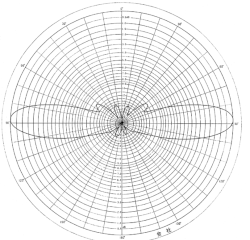

# Getting Started with Repeaters

#### K1JST Jeremy, December 19, 2024

For those who have never checked into a repeater net before, here is a brief overview of the process.

First, make sure you have your radio programmed properly and can open the repeater. If you make a brief transmission when no one is using it with just your call sign you should hear the repeater courtesy tone and tail after you release the PTT button. Even if you can open the repeater, you still aren't sure anyone can actually hear you... So the next thing to do is ask for a radio check. A good time to do this is right after you've heard some people finish a QSO or a few minutes before the net starts. Just "CALLSIGN looking for a radio check" should get you a response. Other good times to try are during drive times or during the day on a weekday when there usually a few people who listen all day (myself included, but I'm usually distracted with work).

Keep in mind, NB1RI is linked to about 14 repeaters and it takes a second or two for your PTT to propagate, so if you don't leave a little extra time between when you key up and when you start speaking your first word or two can easily get cut off. Also, it's good etiquette to leave a few seconds of silence between transmissions in case someone else wants to throw their call sign out and join the conversation.

If you aren't able to get a response, you might need to look at your radio and antenna situation. Low cost HTs are both the best and worst thing every to happen in Amateur Radio. The low cost to entry makes the hobby easily accessible, but the usefulness of a HT depends greatly on how long a distance you wish to communicate. HTs do not have the power or atenna system necessary to diffract or reflect signals over and around obstructions.  Portables work best outside and can have very spotty coverage. You really need near line of sight to the repeater's antenna to get in with a portable. HTs can be a huge turnoff for the new ham who can't actually communicate with anyone either due to difficulty programming or the limitations of their HT. I always recommend a mobile rig as people's first radio, either in the car or at home with a power supply. You can usually find a 2 meter FM rig pretty cheap on riswap.net but if you can't, let me know as I usually have a few around.

I also recommend putting up an antenna outside. A rope over a tree or two chain links fence top rails strapped to a deck or fence post with ratchet straps work great to support a dual band antenna. Homebrew antennas like a J-pole or a quarter wave groundplane work well when you're first starting out. You can also consider commercial options like the Tram 1477, Diamond X30, or Comet GP-1. These commercial options are all 2 element collinear antennas with an omnidirectional horizontal pattern. If you have a little more to spend, you might consider a collinear with more elements (longer with higher gain figures), just keep in mind that more elements menas more gain but a flatter vertical radiation pattern. If you are trying to get into repeaters that are at a significant elevation difference from you, having a higher gain antenna isn't always going to give you a better signal. I have inclided radiation pattern diagrams from the Diamond X30A (2 x 1/4λ, .85dBd, 4.5 ft), X50A (3 x,1/4λ, 2.35dBd, 5.6ft), X200A (2 x 5/8λ, 3.85dBd, 8.3ft)  and X510HD (3 x 5/8λ, 6.15dBd, 17.2ft)  below so you can see the diference. [Yagi-Uda antenas](https://k1jst.github.io/riares-docs/nist_nbs-tn-688-yagi.pdf) can also be useful, but keep in mind that repeaters are almost always vertically polarized and Yagis are directional, so you might want the ability to repoint them. There are other stealthy antenna options if you rent or have a nosy HOA... even a magmout antenna in the attic on a large pizza pan, some wire mesh, or a grill rack can work pretty well.

If you go with an outdoor antenna, you're going to need to be well away from your electrical service entrance if it's not underground, because you want a near zero chance of your antenna and electrical service touching no matter the circumstances. You'll need a piece of coax long enough to get to your entry point (LMR-400 equivalent coax works well for VHF/UHF, though RG-8X is okay if the run is short), a lightning arrestor, and another piece of coax long enough to get into the house and to your radio. If you don't want to drill a hole, a short length of RG-174 or RG-316 with an sma connector will usually make it through the gap between the two panes of your windows and then you can adapt to SO-239 on both ends of the short window passthrough jumper. Other ideas include a two pool noodles with a slit to fit over the window and the sash creating a barrier that will mold around your cables.  Grounding your antenna is important, and if you are unable to ground the antenna properly then you will want a temporary setup where the coax lives outside your house whenever you aren't using it. For proper grounding of antennas see Mike Holt's Free PDF on [NEC Article 810](https://k1jst.github.io/riares-docs/mikeholt_NEC-810.21.pdf) and check out this [Video](https://youtu.be/WRv8AKVAfyc). But I digress.

After you know you can get into the repeater, listen to the net control and follow their instructions. At the appropriate time, key up and say "this is" and then unkey your mic and listen. If you hear anyone else, let them go first and try again when they're done. If you hear no one, key back up and say "This is (Your Callsign Phonetically, i.e. Kilo One Juliet Sierra Tango, Your Name in Your Town." Net control should recognize you and may call you back for comments or information later in the net. If you're nervous or can't stick around, just add "in and out" to your check-in.

Hope to hear you on the next net. The Swap and Sell net on Saturday Morning at 9:00 is a good first net as they really just want to see who's listening and don't want comments or anything.

You can see a list of repeaters at NB1RI.net

Any questions feel free to text, call or email.